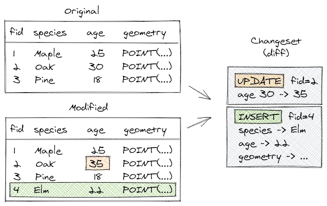
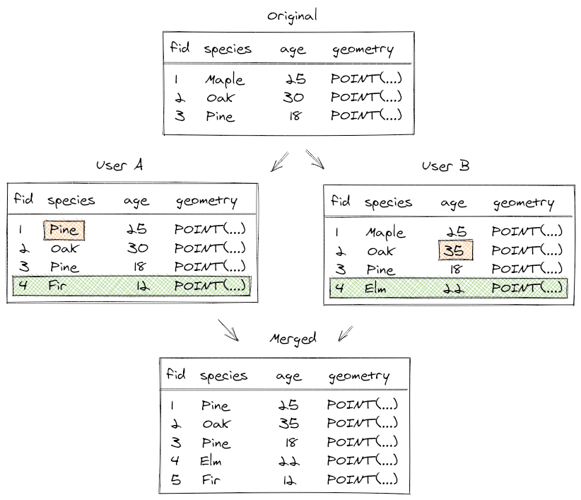

[](https://github.com/lutraconsulting/geodiff/actions?query=workflow%3A%22Coverage+Tests%22)
[](https://github.com/lutraconsulting/geodiff/actions?query=workflow%3A%22MemCheck+Tests%22)
[](https://github.com/lutraconsulting/geodiff/actions?query=workflow%3A%22Code+Layout%22)
[](https://coveralls.io/github/lutraconsulting/geodiff?branch=master)
[](https://badge.fury.io/py/pygeodiff)
[](https://github.com/lutraconsulting/geodiff/actions/workflows/python_packages.yml)

# geodiff

Library for handling diffs for geospatial data. Works with GeoPackage files and PostGIS databases (as well as with non-spatial SQLite and PostgreSQL databases).

Geodiff library is used by [Mergin](https://public.cloudmergin.com/) - a platform for easy sharing of spatial data.

## Use cases for geodiff


### Compare two datasets to get changesets (diffs) & apply changesets

The first use case for geodiff library is to take two datasets with the same structure of tables and compare them - the comparison will create a "diff" file containing entries that were inserted/updated/deleted between the two datasets. A diff file can be applied to an existing dataset (e.g. a GeoPackage) and the dataset will be updated accordingly by applying the differences one by one. If you are familiar with `diff` and `patch` tools from UNIX world, this is meant to be an equivalent for spatial data.



### Merge changes from multiple sources

The next use case is to merge changes from different copies of the same dataset that have been modified independently. Generally such changes cannot be applied cleanly. For example, if multiple users changed the same row of a table, or added a new row with the same ID. The library has functionality to "rebase" a diff file on top of another diff file, resolving any conflicts, so that all the changes can be applied cleanly. There still may be conflicts that can't be resolved fully automatically (e.g. if the same value is modified in different copies), these are written to a separate conflict file that can be addressed later (such changes are typically rare).



### Synchronize data across databases

It is possible to apply diffs across different databases supported by geodiff drivers (nowadays supporting SQLite/GeoPackage and PostgreSQL/PostGIS). That means one can seamlessly find out difference between tables of two schemas in a PostGIS database, and apply the changes to a GeoPackage (or vice versa). Thanks to that, it is possible to keep data in sync even if the backends are completely different.

## How to use geodiff

There are multiple ways how geodiff can be used:

- `geodiff` command line interface (CLI) tool
- `pygeodiff` Python module
- `geodiff` library using C API

The library nowadays comes with support for two drivers:
- SQLite / GeoPackage - always available
- PostgreSQL / PostGIS - optional, needs to be compiled


## Using command line interface

To get changes between two GeoPackage files and write them to `a-to-b.diff` (a binary diff file):
```bash
geodiff diff data-a.gpkg data-b.gpkg a-to-b.diff
```

To print changes between two GeoPackage files to the standard output:
```bash
geodiff diff --json data-a.gpkg data-b.gpkg
```

To apply changes from `a-to-b.diff` to `data-a.gpkg`:
```bash
geodiff apply data-a.gpkg a-to-b.diff
```

To invert a diff file `a-to-b.diff` and revert `data-a.gpkg` to the original content:
```base
geodiff invert a-to-b.diff b-to-a.diff
geodiff apply data-a.gpkg b-to-a.diff
```

The `geodiff` tool supports other various commands, use `geodiff help` for the full list.

## Using Python module

Install the module from pip:
```bash
pip3 install pygeodiff
```

If you get error `ModuleNotFoundError: No module named 'skbuild'` try to update pip with command
`python -m pip install --upgrade pip`

Sample usage of the Python module:

```python
import pygeodiff

geodiff = pygeodiff.GeoDiff()

# create a diff between two GeoPackage files
geodiff.create_changeset('data-a.gpkg', 'data-b.gpkg', 'a-to-b.diff')

# apply changes from a-to-b.diff to the GeoPackage file data-a.gpkg
geodiff.apply_changeset('data-a.gpkg, 'a-to-b.diff')

# export changes from the binary diff format to JSON
geodiff.list_changes('a-to-b.diff', 'a-to-b.json')
```

If there are any problems, calls will raise `pygeodiff.GeoDiffLibError` exception. 

## Using the library with C API

See [geodiff.h header file](https://github.com/lutraconsulting/geodiff/blob/master/geodiff/src/geodiff.h) for the list of API calls and their documentation.

Output messages can be adjusted by GEODIFF_LOGGER_LEVEL environment variable.

## Changesets

Changes between datasets are read from and written to a [binary changeset format](docs/changeset-format.md).

# Building geodiff

Install postgresql client and sqlite3 library, e.g. for Linux
```bash
sudo apt-get install libsqlite3-dev libpq-dev
```
or MacOS (using SQLite from [QGIS deps](https://qgis.org/downloads/macos/deps/)) by defining SQLite variables in 
a cmake configuration as following:
```bash
SQLite3_INCLUDE_DIR=/opt/QGIS/qgis-deps-${QGIS_DEPS_VERSION}/stage/include 
SQLite3_LIBRARY=/opt/QGIS/qgis-deps-${QGIS_DEPS_VERSION}/stage/lib/libsqlite3.dylib 
```

Compile geodiff:
```bash
mkdir build
cd build
cmake .. -DWITH_POSTGRESQL=TRUE
make
```

## Development of geodiff 

### Running tests

C++ tests: run `make test` or `ctest` to run all tests. Alternatively run just a single test, e.g. `./tests/geodiff_changeset_reader_test`

Python tests: you need to setup GEODIFFLIB with path to .so/.dylib from build step
```bash
GEODIFFLIB=`pwd`/../build/libgeodiff.dylib nose2
```

### Releasing new version 

- run `python3 ./scripts/update_version.py --version x.y.z`
- push to GitHub
- tag the master & create github release - Python wheels will be automatically published to PyPI!

## Dependencies & Licensing

Library uses its own copy of
 - [base64](geodiff/src/3rdparty/base64utils.cpp)
 - [endian](geodiff/src/3rdparty/portableendian.h)
 - [libgpkg](https://github.com/luciad/libgpkg) (Apache-2)
